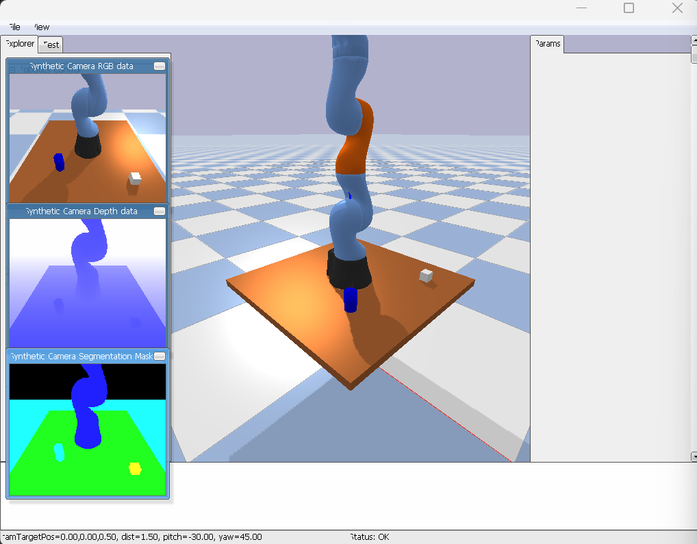

# Robot Simulation

3D robot arm simulation using PyBullet with RGBD camera sensing and point cloud processing.

## Overview
Simulates a Kuka IIWA robot arm mounted on a table with surrounding objects. 
A virtual camera captures RGB and depth images, which are used to generate 
and filter 3D point clouds of the scene.

## Stack
- **PyBullet** — physics simulation & rendering
- **NumPy** — data processing
- **Python 3.10**

## File Structure
```
├── simulation.py           # Main simulation entry point
├── simulation_minimal.py   # Minimal simulation setup
├── sensors.py              # Camera config & RGBD capture
├── kinematics.py           # Robot kinematics
├── circle_objects.py       # Circle obstacle objects
├── helper_classes.py       # Shared utilities
├── model.py                # Neural network model
├── test_pointcloud.py      # Point cloud & filter tests
```

## Setup

### 1. Create environment
```bash
conda create -n robotsim python=3.10
conda activate robotsim
```

### 2. Install dependencies
```bash
pip install -r requirements.txt
```

### 3. Run the simulation
```bash
python simulation.py
```
A PyBullet GUI window will open showing the Kuka arm on the table.  
Press `Ctrl+C` to stop.



## How it works
1. `simulation.py` sets up the scene (plane, table, robot, objects)
2. `sensors.py` captures an RGBD image from a configurable virtual camera
3. `test_obstacles.py` processes the depth image into a 3D point cloud and filters it
4. The simulation keeps running at 240Hz until manually stopped
